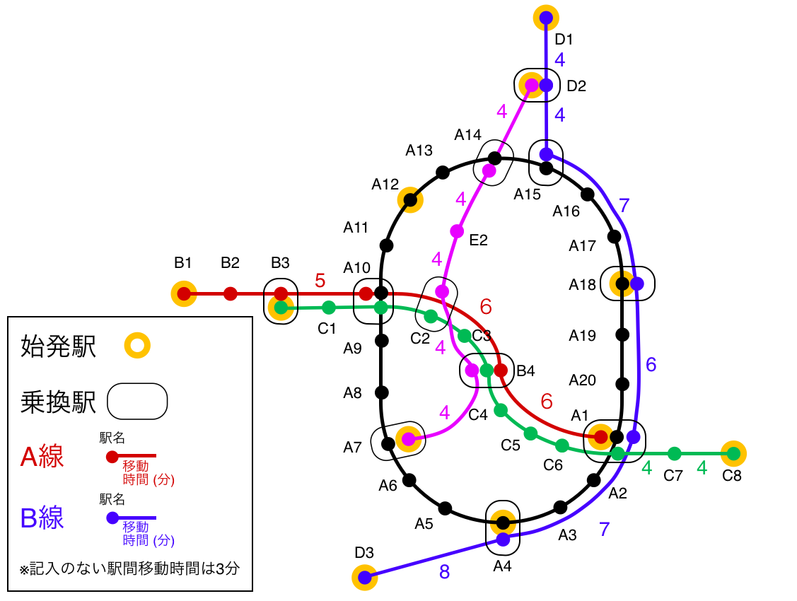

# [上級問題] ほへと市鉄道の乗換案内を作成せよ！



ほへと市には複数の路線が走っています。  
これらの路線内の任意の2駅を結ぶ乗換案内のCLIアプリケーションを作成してください。

##### 運行に関する条件
- 6:00にすべての始発駅から電車が発車する。環状線は上下線ともに発車する。それ以降の発車間隔は以下のとおり。
  - 路線A 6分
  - 路線B 8分
  - 路線C 6分
  - 路線D 8分
  - 路線E 8分
- 7:00以降（7:00を含む）に始発駅を発車した直後から，環状線Aを除く各線の始発駅からの発車間隔は以下のとおりとなる。
  - 路線B 4分
  - 路線C 4分
  - 路線D 5分
  - 路線E 5分
- 9:00以降（9:00を含む）に始発駅を発車した直後からはまた元の間隔に戻る．
- 環状線Aは7:00以降、先の電車が始発駅の次の駅に着いた時刻に、始発駅を出る電車がなければ、そこから始発電車を出す。
  - このため7時台のいつかは電車が3分間隔になる。
  - 9:00以降は始発駅（終点駅）に7:00以降に始発電車として出発した電車が着いたら、そこをその電車の終点とする。
  - こうして9時台のいつかは6分間隔に戻る。
- 23時以降（23:00を含む）に始発駅を出発する電車はない
- 23時以降（23:00を含む）に電車が始発駅に到着した場合、そこで運行を終える。

## ザ・ミッション
任意の2駅を結ぶ最速の乗換経路を示すCLIアプリケーションを作成してください。

## 実装方法

##### CLIアプリケーションについて
入力値を引数に取り、結果を標準出力に出力するCLIアプリケーションとして解答を実装してください。
CLIの実装方法については[指定言語].mdを参照ください。

##### 引数

このアプリケーションでは引数として以下の3つが与えられます。

- 出発駅名(ex. A1, B3 ...)
- 到着駅名(ex. A1, B3 ...)
- 時刻。HH:MM形式(ex. 08:24)

出力の形式は「路線名 出発駅 出発時刻 到着(乗換)駅 到着時刻」を1行とし、最終到着駅までのすべての電車を出力します。

```
$ myApp A1 C5 08:00
A A1 08:01 A5 09:13
B A5 09:17 B8 10:11
C B8 10:15 C5 11:01
```

※ 入力の引数が不正な場合はエラーメッセージを表示して終了コード(-1)で終了するようにします。

##### ヒント
- CLIで指定された出発時刻と出発駅の電車の出発時刻が同じ場合はその電車に乗ることができます。
- 乗換駅で乗換に要する時間は1分です。
  - 乗換駅に10:45に到着した場合、10:46の電車には乗れますが10:45の電車には乗れません。
- テストケースには出発時間が21時以降のケースは含まれていません。
  - 経路が終電にかかることはないので、終電の計算を厳密に行う必要はありません。

##### 到着時刻が同じ経路が複数ある場合
この問題では同じ時間に到着駅に到達する経路が複数ある場合があります。
その場合は以下の順に比較をして経路を一つ選択して出力してください。

- 出発駅での出発時刻が異なる場合はもっとも出発時間の遅くなる経路を選択します。
- 乗換回数が異なる場合はもっとも乗換回数の少ない経路を選択します。
- 出発時間、乗換回数とも同じ場合は乗換時間の合計の長い(乗換に余裕のある)経路を選択します。
- 経過する駅数が異なる場合は駅数が少ない経路を選択します。
- これらすべて同じ場合は、経路中で使用した各路線を以下のポイントで合計し、ポイントの合計の少ない経路を選択します。
  - 路線A: 1 x 経過駅数
  - 路線B: 2 x 経過駅数
  - 路線C: 4 x 経過駅数
  - 路線D: 8 x 経過駅数
  - 路線D: 16 x 経過駅数
- 同一経路の途中で電車を一本遅らせても同じ時間に到着駅に到達できる場合は、到着駅に近い方の駅で乗換時間を長く取る方を選択してください。
- 環状線だけを使って正反対の位置の駅に向かう経路(A3-A13など)では上り・下りのどちらを使用しても同じ時間がかかります。この場合は上り・下りのどちらの経路を選択しても構いません。(出力上はどちらを選択しても差異はありません。)

例：路線数は同じだが乗換時間が異なる場合

```
## C5 to B1 at 20:14

経路1
C C5 20:14 - B3 20:35
B B3 20:37 - B1 20:43


経路2
C C5 20:14 - B4 20:20
B B4 20:26 - B1 20:43
```

C5からB1に行くためには路線Cから路線Bに乗り換える必要があります。
この時、B3、B4のどちらで乗り換えても同じ電車に乗ることができますが、B4乗り換えの方が乗換時間が長いので経路２を選択します。

例：中間の電車を一本遅らせることができる場合

```
## D1 to B1 at 17:08

経路1
D D1 17:12 - A15 17:20
A A15 17:21 - A10 17:36
B A10 17:44 - B1 17:55

経路2
D D1 17:12 - A15 17:20
A A15 17:27 - A10 17:42
B A10 17:44 - B1 17:55
```

同じ路線を使い、到着時刻も同じだが経路1はA10駅での乗換時間を長く取っているのに対し、経路2はA15駅での乗換時間を長く取っている。
A10駅の方が到着駅に近いので経路1を選択します。


##### テストケース
100個のテストケースが[testcase3.md](test/testcase3.md)によって与えられています。  
また、これとは別にさらに100個の秘密のテストケースが存在します。

すべてのテストにパスした場合のスコアは200/200になります。

## answer.md
[answer.md](./answer.md)を用意してあるので、その中に
- どのように実装したか、工夫した点は何か
- 発生した問題、難しかった箇所
- それをどのようにして対処したのか

等を書いてください。


*これは[codecheck](http://app.code-check.io/openchallenges)のチャレンジだよ。 始めてみるには[ドキュを見てね](https://code-check.github.io/docs/ja)* ^^  
